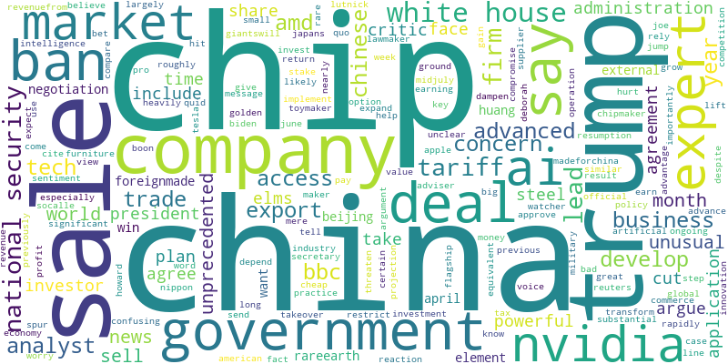

# Extracting Key Themes from BBC News Using NLP

## Project Overview
This project demonstrates practical NLP techniques by scraping a BBC news article, preprocessing the text, lemmatizing tokens, and generating a WordCloud to visualize the dominant keywords. It highlights how text data can be analyzed to extract insights, which is valuable in marketing, content strategy, and digital analytics.

**News Article Headline:**  
*“The US is taking a cut from chip sales to China - what does it mean?”*

---

## WordCloud Visualization


---

## Tech Stack
- **Python** – programming language
- **BeautifulSoup** – web scraping
- **NLTK / spaCy** – text preprocessing and lemmatization
- **WordCloud & Matplotlib** – visualization

---

## Key Skills Demonstrated
- Web scraping and text extraction from news articles
- Text preprocessing: tokenization, stopword removal, lemmatization
- Generating wordclouds to visualize dominant themes
- Translating raw textual data into actionable insights

---

## How to Run
1. Clone this repository:  
   ```bash
   git clone https://github.com/yourusername/bbc-news-wordcloud-nlp.git
